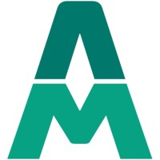

# 🌐 Portfólio • Paula Bezerra

Este é o meu portfólio profissional desenvolvido com **React + Vite**, onde apresento meus principais projetos, habilidades e formações.  
O objetivo é mostrar minha evolução como desenvolvedora e centralizar links importantes como GitHub, LinkedIn e currículo.

---

## 🚀 Tecnologias e Habilidades

O portfólio foi construído em **React** com foco em responsividade, acessibilidade e boas práticas.  
Além disso, destaco minhas principais skills:

- **Front-End:** JavaScript, TypeScript, React, Redux, Vue.js, Angular  
- **Fundamentos:** HTML5, CSS3, Git, Terminal, SQL, POO (Programação Orientada a Objetos)  
- **Metodologias:** Scrum, práticas ágeis  
- **Extras:** GenAI Essentials

---

## 💻 Projetos em Destaque

- 🎨 **[StudioP Concept](https://studiop-concept.vercel.app/)**  
  Site institucional para salão de beleza, focado em design responsivo, UX e identidade visual.

- 🎬 **[Movie Finder](https://movie-finder-7lfo.vercel.app/)**  
  Aplicação para busca de filmes com **debounce**, favoritos persistidos e gerenciamento de estado com Redux Toolkit.

---

## 🎓 Formação

-  **Mate Academy — Full Stack**  
  Formação em desenvolvimento Full Stack com foco em projetos reais, Git, testes e boas práticas.

-  **Universidade Anhembi Morumbi — ADS**  
  Graduação em Análise e Desenvolvimento de Sistemas com ênfase em fundamentos de computação, SQL e engenharia de software.

---

## 🔗 Links Importantes

- [](https://github.com/pabezerra)  
- [](https://www.linkedin.com/in/paulaabezera/)  
- **Currículo:** disponível em breve neste portfólio (o botão já está preparado para receber o link do PDF).

---

## 🛠 Como rodar localmente

```bash
git clone https://github.com/pabezerra/portfolio
cd portfolio
npm install
npm run dev
